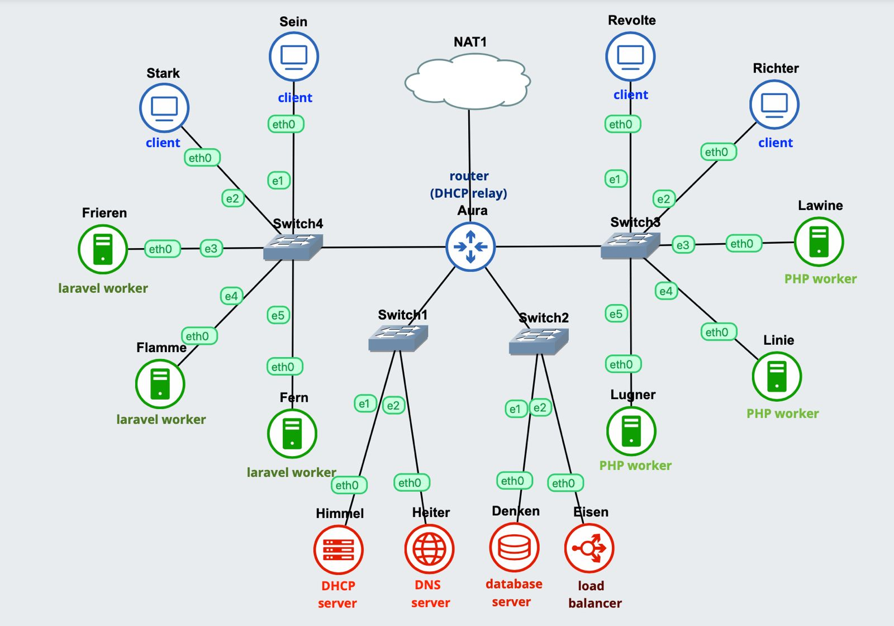
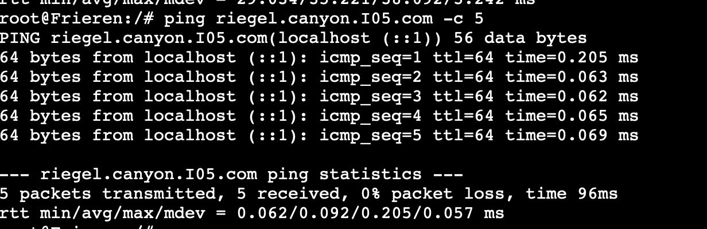
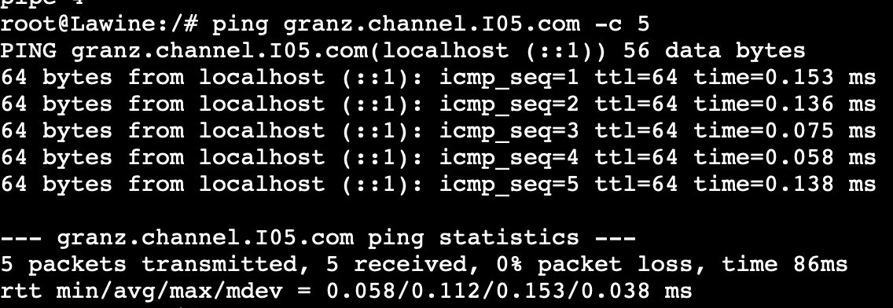

# Jarkom-Modul-3-I05-2023

## Modul 3 Jarkom 2023 I05 Formal Report

Group Members:
| No |  Name    |  NRP  |
| ---       |   ---     |---  |
|     1     |     Khairiya Maisa Putri    | 5025211192 |
|     2     |     Talitha Hayyinas Sahala    |  5025211263 |

## Topologi


## Node Configurations

- **Aura : Router (DHCP Relay)**
```
auto eth0
iface eth0 inet dhcp

auto eth1
iface eth1 inet static
	address 10.61.1.1
	netmask 255.255.255.0

auto eth2
iface eth2 inet static
	address 10.61.2.1
	netmask 255.255.255.0

auto eth3
iface eth3 inet static
	address 10.61.3.1
	netmask 255.255.255.0

auto eth4
iface eth4 inet static
	address 10.61.4.1
	netmask 255.255.255.0
```
- **Himmel : DHCP Server**
```
auto eth0
iface eth0 inet static
	address 10.61.1.2
	netmask 255.255.255.0
	gateway 10.61.1.1
```
- **Heiter : DNS Server**
```
auto eth0
iface eth0 inet static
	address 10.61.1.3
	netmask 255.255.255.0
	gateway 10.61.1.1
```
- **Denken : Database Server**
```
auto eth0
iface eth0 inet static
    address 10.61.2.2
    netmask 255.255.255.0
    gateway 10.61.2.1
```
- **Eisen : Load Balancer**
```
auto eth0
iface eth0 inet static
	address 10.61.2.3
	netmask 255.255.255.0
	gateway 10.61.2.1
```
- **Frieren : Laravel Worker**
```
auto eth0
iface eth0 inet static
	address 10.61.4.4
	netmask 255.255.255.0
	gateway 10.61.4.1
```
- **Flamme : Laravel Worker**
```
auto eth0
iface eth0 inet static
	address 10.61.4.5
	netmask 255.255.255.0
	gateway 10.61.4.1
```
- **Fern : Laravel Worker**
```
auto eth0
iface eth0 inet static
	address 10.61.4.6
	netmask 255.255.255.0
	gateway 10.61.4.1
```
- **Lawine : PHP Worker**
```
auto eth0
iface eth0 inet static
	address 10.61.3.4
	netmask 255.255.255.0
	gateway 10.61.3.1
```
- **Linie : PHP Worker**
```
auto eth0
iface eth0 inet static
	address 10.61.3.5
	netmask 255.255.255.0
	gateway 10.61.3.1
```
- **Lugner : PHP Worker**
```
auto eth0
iface eth0 inet static
	address 10.61.3.6
	netmask 255.255.255.0
	gateway 10.61.3.1
```
- **Revolte : Client**
```
auto eth0
iface eth0 inet dhcp
```
- **Richter : Client**
```
auto eth0
iface eth0 inet dhcp
```
- **Sein : Client**
```
auto eth0
iface eth0 inet dhcp
```
- **Stark : Client**
```
auto eth0
iface eth0 inet dhcp
```

## Preparation
On every nodes, edit the ```.bashrc``` file using ```nano``` command, where we write ```bash /root/script.sh``` inside it. And then inside the ```script.sh``` file we write some needed commands for each nodes, like these:

- **Himmel : DHCP Server**
```
echo 'nameserver 192.168.122.1' > /etc/resolv.conf

apt-get update
apt-get install isc-dhcp-server -y
cp -r -f /root/prak3/etc /
service isc-dhcp-server restart
```
- **Heiter : DNS Server**
```
echo 'nameserver 192.168.122.1' > /etc/resolv.conf

apt-get update
apt-get install bind9 -y
cp -r -f /root/prak3/etc /
service bind9 restart
```
- **Aura : Router (DHCP Relay)**
```
echo 'nameserver 192.168.122.1' > /etc/resolv.conf

apt-get update
apt-get install isc-dhcp-relay -y
service isc-dhcp-relay start
cp -r -f /root/prak3/etc /
service isc-dhcp-relay restart
```
- **Denken : Database Server**
```
echo 'nameserver 192.168.122.1' > /etc/resolv.conf

apt-get update
apt-get install mariadb-server -y
service mysql start

cp -r -f /root/prak3/etc /
```
- **Eisen : Load Balancer**
```
cp -r -f /root/prak3/etc /

echo nameserver 192.168.122.1 > /etc/resolv.conf
apt-get update
apt-get install apache2-utils -y
apt-get install nginx -y
apt-get install lynx -y

service nginx start
```
- **Frieren : Laravel Worker**
```
echo nameserver 192.168.122.1 > /etc/resolv.conf

cp -r -f /root/prak3/etc /

apt-get update
apt-get install lynx -y
apt-get install mariadb-client -y
apt-get install -y lsb-release ca-certificates a   apt-transport-https software-properties-common gnupg2
curl -sSLo /usr/share/keyrings/deb.sury.org-php.gpg https://packages.sury.org/php/apt.gpg
sh -c 'echo "deb [signed-by=/usr/share/keyrings/deb.sury.org-php.gpg] https://packages.sury.org/php/ $(lsb_release -sc) main" > /etc/apt/sources.list.d/php.list'
apt-get update
apt-get install php8.0-mbstring php8.0-xml php8.0-cli   php8.0-common php8.0-intl php8.0-opcache php8.0-readline php8.0-mysql php8.0-fpm php8.0-curl unzip wget -y
apt-get install nginx -y

service nginx start
service php8.0-fpm start
```
- **Flamme : Laravel Worker**
```
echo 'nameserver 192.168.122.1' > /etc/resolv.conf

cp -r -f /root/prak3/etc /

apt-get update
apt-get install lynx -y
apt-get install mariadb-client -y
apt-get install -y lsb-release ca-certificates a   apt-transport-https software-properties-common gnupg2
curl -sSLo /usr/share/keyrings/deb.sury.org-php.gpg https://packages.sury.org/php/apt.gpg
sh -c 'echo "deb [signed-by=/usr/share/keyrings/deb.sury.org-php.gpg] https://packages.sury.org/php/ $(lsb_release -sc) main" > /etc/apt/sources.list.d/php.list'
apt-get update
apt-get install php8.0-mbstring php8.0-xml php8.0-cli   php8.0-common php8.0-intl php8.0-opcache php8.0-readline php8.0-mysql php8.0-fpm php8.0-curl unzip wget -y
apt-get install nginx -y

service nginx start
service php8.0-fpm start
```
- **Fern : Laravel Worker**
```
echo 'nameserver 192.168.122.1' > /etc/resolv.conf

cp -r -f /root/prak3/etc /

apt-get update
apt-get install lynx -y
apt-get install mariadb-client -y
apt-get install -y lsb-release ca-certificates a   apt-transport-https software-properties-common gnupg2
curl -sSLo /usr/share/keyrings/deb.sury.org-php.gpg https://packages.sury.org/php/apt.gpg
sh -c 'echo "deb [signed-by=/usr/share/keyrings/deb.sury.org-php.gpg] https://packages.sury.org/php/ $(lsb_release -sc) main" > /etc/apt/sources.list.d/php.list'
apt-get update
apt-get install php8.0-mbstring php8.0-xml php8.0-cli   php8.0-common php8.0-intl php8.0-opcache php8.0-readline php8.0-mysql php8.0-fpm php8.0-curl unzip wget -y
apt-get install nginx -y

service nginx start
service php8.0-fpm start
```
- **Lawine : PHP Worker**
```
echo 'nameserver 192.168.122.1' > /etc/resolv.conf

cp -r -f /root/prak3/etc /

apt-get update
apt-get install php php-fpm
service php7.3-fpm status
apt-get install wget
apt-get install unzip

wget --no-check-certificate 'https://drive.usercontent.google.com/download?id=1$
unzip granz.channel.I05.com
cp -r modul-3/ /var/www
rm -r modul-3

ln -s /etc/nginx/sites-available/jarkom /etc/nginx/sites-enabled
rm -r /etc/nginx/sites-enabled/default

service nginx reload
service nginx restart

service php7.3-fpm start
service php7.3-fpm restart
```
- **Linie : PHP Worker**
```
echo 'nameserver 192.168.122.1' > /etc/resolv.conf

cp -r -f /root/prak3/etc /

apt-get update
apt-get install php php-fpm
service php7.3-fpm status
apt-get install wget
apt-get install unzip

wget --no-check-certificate 'https://drive.usercontent.google.com/download?id=1$
unzip granz.channel.I05.com
cp -r modul-3/ /var/www
rm -r modul-3

ln -s /etc/nginx/sites-available/jarkom /etc/nginx/sites-enabled
rm -r /etc/nginx/sites-enabled/default

service nginx reload
service nginx restart

service php7.3-fpm start
service php7.3-fpm restart
```
- **Lugner : PHP Worker**
```
echo 'nameserver 192.168.122.1' > /etc/resolv.conf

cp -r -f /root/prak3/etc /

apt-get update
apt-get install php php-fpm
service php7.3-fpm status
apt-get install wget
apt-get install unzip

wget --no-check-certificate 'https://drive.usercontent.google.com/download?id=1$
unzip granz.channel.I05.com
cp -r modul-3/ /var/www
rm -r modul-3

ln -s /etc/nginx/sites-available/jarkom /etc/nginx/sites-enabled
rm -r /etc/nginx/sites-enabled/default

service nginx reload
service nginx restart

service php7.3-fpm start
service php7.3-fpm restart
```
- **Revolte : Client**
```
echo nameserver 192.168.122.1 > /etc/resolv.conf

apt update
apt install lynx -y
apt install htop -y
apt install apache2-utils -y
apt-get install jq -y
service apache2 start

cp -r -f /root/prak3/etc /

```
- **Richter : Client**
```
echo nameserver 192.168.122.1 > /etc/resolv.conf

apt update
apt install lynx -y
apt install htop -y
apt install apache2-utils -y
apt-get install jq -y
service apache2 start

cp -r -f /root/prak3/etc /
```
- **Sein : Client**
```
echo nameserver 192.168.122.1 > /etc/resolv.conf

apt update
apt install lynx -y
apt install htop -y
apt install apache2-utils -y
apt-get install jq -y
service apache2 start

cp -r -f /root/prak3/etc /
```
- **Stark : Client**
```
echo nameserver 192.168.122.1 > /etc/resolv.conf

apt update
apt install lynx -y
apt install htop -y
apt install apache2-utils -y
apt-get install jq -y
service apache2 start

cp -r -f /root/prak3/etc /
```
# No. 1
> Lakukan konfigurasi sesuai dengan peta yang sudah diberikan.

The first thing that we need to do is to prepare the configurations for the topologi above, then we were asked to register 2 domains which are **riegel.canyon.yyy.com** for the ```Laravel Worker``` and **granz.channel.yyy.com** for the ```PHP Worker``` that points to the workers with IP address ```10.61.x.1```. Since I started the IP address for each nodes from ```x.4``` and not ```x.1```, I will use the nodes with IP address of ```x.4```. To do this, we need to run some command on the DNS Server, which is Heiter:

### Script
```sh
echo 'zone "riegel.canyon.I05.com" {
	type master;
	file "/etc/bind/jarkom/riegel.canyon.I05.com";
};

zone "granz.channel.I05.com" {
	type master;
	file "/etc/bind/jarkom/granz.channel.I05.com";
};
' > /etc/bind/named.conf.local

mkdir /etc/bind/jarkom
cp /etc/bind/db.local /etc/bind/jarkom/riegel.canyon.I05.com
cp /etc/bind/db.local /etc/bind/jarkom/granz.channel.I05.com

echo ';
; BIND data file for local loopback interface
;
$TTL    604800
@       IN      SOA     riegel.canyon.I05.com. root.riegel.canyon.I05.com. (
                     2023111601         ; Serial
                         604800         ; Refresh
                          86400         ; Retry
                        2419200         ; Expire
                         604800 )       ; Negative Cache TTL
;
@       IN      NS      riegel.canyon.I05.com.
@       IN      A       10.61.1.3               ; IP Heiter
@       IN      A       10.61.4.4               ; IP Frieren
www     IN      CNAME   riegel.canyon.I05.com.
@       IN      AAAA    ::1
' > /etc/bind/jarkom/riegel.canyon.I05.com

echo ';
; BIND data file for local loopback interface
;
$TTL    604800
@       IN      SOA     granz.channel.I05.com. root.granz.channel.I05.com. (
                     2023111601         ; Serial
                         604800         ; Refresh
                          86400         ; Retry
                        2419200         ; Expire
                         604800 )       ; Negative Cache TTL
;
@       IN      NS      granz.channel.I05.com.
@       IN      A       10.61.1.3               ; IP Heiter
@       IN      A       10.61.3.4               ; IP Lawine
www     IN      CNAME   granz.channel.I05.com.
@       IN      AAAA    ::1
' > /etc/bind/jarkom/granz.channel.I05.com

service bind9 restart
```

After we run the script above, we will move to the **Frieren** and **Lawine** nodes and do some testing to check if it succeed or not, by first connecting the node to the internet and then run the ```ping``` command. 

On **Frieren** :
```sh
ping riegel.canyon.I05.com
```


On **Lawine** :
```sh
ping granz.channel.I05.com
```


# No. 2
> Semua CLIENT harus menggunakan konfigurasi dari DHCP Server.
Client yang melalui Switch3 mendapatkan range IP dari [prefix IP].3.16 - [prefix IP].3.32 dan [prefix IP].3.64 - [prefix IP].3.80

To do this we need to run the command below to the DHCP Server so that the clients that are on the **Switch 3** will get range of IP from ```[prefix IP].3.16 - [prefix IP].3.32 and [prefix IP].3.64 - [prefix IP].3.80```

### Script
```sh
echo 'subnet 10.61.1.0 netmask 255.255.255.0 {}
subnet 10.61.2.0 netmask 255.255.255.0 {}

subnet 10.61.3.0 netmask 255.255.255.0 {
    range 10.61.3.16 10.61.3.32;
    range 10.61.3.64 10.61.3.80;
    option routers 10.61.3.1;
}' > /etc/dhcp/dhcpd.conf
```

# No. 3
> Client yang melalui Switch4 mendapatkan range IP dari [prefix IP].4.12 - [prefix IP].4.20 dan [prefix IP].4.160 - [prefix IP].4.168

To do this we need to add some new configurations for the clients on **Switch 4**, like this:

### Script
```sh
echo 'subnet 10.61.1.0 netmask 255.255.255.0 {}
subnet 10.61.2.0 netmask 255.255.255.0 {}

subnet 10.61.3.0 netmask 255.255.255.0 {
    range 10.61.3.16 10.61.3.32;
    range 10.61.3.64 10.61.3.80;
    option routers 10.61.3.1;
}

subnet 10.61.4.0 netmask 255.255.255.0 {
    range 10.61.4.12 10.61.4.20;
    range 10.61.4.160 10.61.4.168;
    option routers 10.61.4.1;
}' > /etc/dhcp/dhcpd.conf
```

# No. 4
> Client mendapatkan DNS dari Heiter dan dapat terhubung dengan internet melalui DNS tersebut

For this number, we need to add some configurations such as ```option broadcast-address``` and ```option domain-name-servers``` so that the DNS that the client got from Heiter can be used.

### Script
```sh
echo 'subnet 10.61.1.0 netmask 255.255.255.0 {}
subnet 10.61.2.0 netmask 255.255.255.0 {}

subnet 10.61.3.0 netmask 255.255.255.0 {
    range 10.61.3.16 10.61.3.32;
    range 10.61.3.64 10.61.3.80;
    option routers 10.61.3.1;
    option broadcast-address 10.61.3.255;
    option domain-name-servers 10.61.1.3;
}

subnet 10.61.4.0 netmask 255.255.255.0 {
    range 10.61.4.12 10.61.4.20;
    range 10.61.4.160 10.61.4.168;
    option routers 10.61.4.1;
    option broadcast-address 10.61.4.255;
    option domain-name-servers 10.61.1.3;
}' > /etc/dhcp/dhcpd.conf
```

# No. 5
> Lama waktu DHCP server meminjamkan alamat IP kepada Client yang melalui Switch3 selama 3 menit sedangkan pada client yang melalui Switch4 selama 12 menit. Dengan waktu maksimal dialokasikan untuk peminjaman alamat IP selama 96 menit.

### Script
```sh
echo 'subnet 10.61.1.0 netmask 255.255.255.0 {}
subnet 10.61.2.0 netmask 255.255.255.0 {}

subnet 10.61.3.0 netmask 255.255.255.0 {
    range 10.61.3.16 10.61.3.32;
    range 10.61.3.64 10.61.3.80;
    option routers 10.61.3.1;
    option broadcast-address 10.61.3.255;
    option domain-name-servers 10.61.1.3;
    default-lease-time 180;
    max-lease-time 5760;
}

subnet 10.61.4.0 netmask 255.255.255.0 {
    range 10.61.4.12 10.61.4.20;
    range 10.61.4.160 10.61.4.168;
    option routers 10.61.4.1;
    option broadcast-address 10.61.4.255;
    option domain-name-servers 10.61.1.3;
    default-lease-time 720;
    max-lease-time 5760;
}' > /etc/dhcp/dhcpd.conf
```

# No. 6
> Pada masing-masing worker PHP, lakukan konfigurasi virtual host untuk website berikut dengan menggunakan php 7.3.

Before starting, we need to set up all PHP Workers first. After that do these configurations to **download** and **unzip** using the ```wget``` command.

### Script
On PHP Worker (Lawine, Linie, Lugner)
```sh
wget --no-check-certificate 'https://drive.usercontent.google.com/download?id=1ViSkRq7SmwZgdK64eRbr5Fm1EGCTPrU1&export=download&authuser=0&confirm=t&uuid=0e499712-8150-42d4-a474-b29dfb026ab6&at=APZUnTVBse4ducwDDntmAkLSWB1_:1699949521984' -O  granz.channel.I05.com

unzip granz.channel.I05.com
cp -r modul-3/ /var/www
rm -r modul-3

echo 'server {
   	listen 80;
   	root /var/www/modul-3;
   	index index.php index.html index.htm;
   	server_name _;
   	location / {
   			try_files $uri $uri/ /index.php?$query_string;
   	}
   	# pass PHP scripts to FastCGI server
   	location ~ \.php$ {
   	include snippets/fastcgi-php.conf;
   	fastcgi_pass unix:/var/run/php/php7.3-fpm.sock;
   	}
   	location ~ /\.ht {
   			deny all;
   	}
   	error_log /var/log/nginx/jarkom_error.log;
   	access_log /var/log/nginx/jarkom_access.log;
}' > /etc/nginx/sites-available/jarkom

ln -s /etc/nginx/sites-available/jarkom /etc/nginx/sites-enabled
rm -r /etc/nginx/sites-enabled/default

service nginx reload
service nginx restart

service php7.3-fpm start
service php7.3-fpm restart
```

On All Clients (We made settings in Revolte) testing using this command:
```sh
lynx granz.channel.I05.com
```

# No. 7
> Kepala suku dari Bredt Region memberikan resource server sebagai berikut:
Lawine, 4GB, 2vCPU, dan 80 GB SSD.
Linie, 2GB, 2vCPU, dan 50 GB SSD.
Lugner 1GB, 1vCPU, dan 25 GB SSD.
aturlah agar Eisen dapat bekerja dengan maksimal, lalu lakukan testing dengan 1000 request dan 100 request/second.

On Eisen
```sh
echo 'upstream myweb {
       server 10.61.3.4;
       server 10.61.3.5;
       server 10.61.3.6;
}

server {
        listen 80;
        server_name granz.channel.I05.com;
        location / {
        proxy_pass http://myweb;
        }
}' > /etc/nginx/sites-available/lb-jarkom

ln -s /etc/nginx/sites-available/lb-jarkom /etc/nginx/sites-enabled
rm -r /etc/nginx/sites-enabled/default
service nginx start
```
On Heiter
```sh
echo ';
; BIND data file for local loopback interface
;
$TTL    604800
@       IN      SOA     granz.channel.I05.com. root.granz.channel.I05.com. (
                     2023111601         ; Serial
                         604800         ; Refresh
                          86400         ; Retry
                        2419200         ; Expire
                         604800 )       ; Negative Cache TTL
;
@       IN      NS      granz.channel.I05.com.
@       IN      A       10.61.2.3               ; IP Load Balancer
www     IN      CNAME   granz.channel.I05.com.
@       IN      AAAA    ::1 
' > /etc/bind/jarkom/granz.channel.I05.com

service bind9 restart
```
Testing on Revolte using this command:
```
ab -n 1000 -c 100 http://www.granz.channel.I05.com/ 
```

# No. 8
> Karena diminta untuk menuliskan grimoire, buatlah analisis hasil testing dengan 200 request dan 10 request/second masing-masing algoritma Load Balancer dengan ketentuan sebagai berikut:
Nama Algoritma Load Balancer,
Report hasil testing pada Apache Benchmark,
Grafik request per second untuk masing masing algoritma, 
Analisis

The rest of the configuration is the same as Question 7
## Script
Run the following command on the `Revolte` client
```
ab -n 200 -c 10 http://www.granz.channel.a09.com/ 
```

# No. 9
> Dengan menggunakan algoritma Round Robin, lakukan testing dengan menggunakan 3 worker, 2 worker, dan 1 worker sebanyak 100 request dengan 10 request/second, kemudian tambahkan grafiknya pada grimoire.

Before working on it, it's necessary to set up first. After setting up the `Eisen` node, now perform testing on the previously created load balancer. The key difference is that testing needs to be done using `1 worker`, `2 workers`, and `3 worker`.
## Script
Run the following command on the `Revolte` client
```
ab -n 100 -c 10 http://www.granz.channel.I05.com/ 
```
# No. 10
> Selanjutnya coba tambahkan konfigurasi autentikasi di LB dengan dengan kombinasi username: “netics” dan password: “ajkyyy”, dengan yyy merupakan kode kelompok. Terakhir simpan file “htpasswd” nya di /etc/nginx/rahasisakita/

Before working on it, it's necessary to set up first. After that, perform several configurations as follows
## Script
```
mkdir /etc/nginx/rahasisakita
htpasswd -c /etc/nginx/rahasisakita/htpasswd netics
```

# No. 11
> Lalu buat untuk setiap request yang mengandung /its akan di proxy passing menuju halaman https://www.its.ac.id.

We need to add some configurations on nginx like this:

### Script
```sh
echo 'upstream worker {
    server 10.61.3.6;
    server 10.61.3.5;
    server 10.61.3.4;
}

server {
    listen 80;
    server_name granz.channel.I05.com www.granz.channel.I05.com;

    root /var/www/html;
    index index.html index.htm index.nginx-debian.html;

    location / {
        proxy_pass http://worker;
    }

    location ~ /its {
        proxy_pass https://www.its.ac.id;
        proxy_set_header Host www.its.ac.id;
        proxy_set_header X-Real-IP $remote_addr;
        proxy_set_header X-Forwarded-For $proxy_add_x_forwarded_for;
        proxy_set_header X-Forwarded-Proto $scheme;
    }
}' > /etc/nginx/sites-available/lb_php
```
The meaning is that when we access an endpoint containing ```/its```, it will be redirected by **proxy_pass** to https://www.its.ac.id.

Testing on Revolte using this command:
```
lynx www.granz.channel.I05.com/its
```

# No. 12
> Selanjutnya LB ini hanya boleh diakses oleh client dengan IP [Prefix IP].3.69, [Prefix IP].3.70, [Prefix IP].4.167, dan [Prefix IP].4.168.

This question ask us to only allow the access of the IP addresses on the question, and other than those 4 IPs needs to be denied for access. To do this question, we need to add some configurations on nginx like this:

### Script
```sh
echo 'upstream worker {
    server 10.61.3.6;
    server 10.61.3.5;
    server 10.61.3.4;
}

server {
    listen 80;
    server_name granz.channel.I05.com www.granz.channel.I05.com;

    root /var/www/html;
    index index.html index.htm index.nginx-debian.html;

    location / {
        allow 10.61.3.69;
        allow 10.61.3.70;
        allow 10.61.4.167;
        allow 10.61.4.168;
        deny all;
        proxy_pass http://worker;
    }

    location /its {
        proxy_pass https://www.its.ac.id;
        proxy_set_header Host www.its.ac.id;
        proxy_set_header X-Real-IP $remote_addr;
        proxy_set_header X-Forwarded-For $proxy_add_x_forwarded_for;
        proxy_set_header X-Forwarded-Proto $scheme;
    }
}' > /etc/nginx/sites-available/lb_php
```

# No. 13
> Semua data yang diperlukan, diatur pada Denken dan harus dapat diakses oleh Frieren, Flamme, dan Fern.

After installing the mysql, we need to change the configuration on ```/etc/mysql/mariadb.conf.d/50-server.cnf``` into:
```
bind-address            = 0.0.0.0
```
And the next thing that we need to do is:

### Script
```sh
echo '# This group is read both both by the client and the server
# use it for options that affect everything
#
[client-server]

# Import all .cnf files from configuration directory
!includedir /etc/mysql/conf.d/
!includedir /etc/mysql/mariadb.conf.d/

[mysqld]
skip-networking=0
skip-bind-address' >  /etc/mysql/my.cnf
```
Restart mysql by running this command:
```
service mysql restart
```

After restarting mysql, run these commands:
```
mysql -u root -p
Enter password: 

CREATE USER 'kelompokI05'@'%' IDENTIFIED BY 'passwordI05';
CREATE USER 'kelompokI05'@'localhost' IDENTIFIED BY 'passwordI05';
CREATE DATABASE dbkelompokI05;
GRANT ALL PRIVILEGES ON *.* TO 'kelompokI05'@'%';
GRANT ALL PRIVILEGES ON *.* TO 'kelompokI05'@'localhost';
FLUSH PRIVILEGES;
```
Testing on Fern:
```sh
mariadb --host=10.61.2.2 --port=3306 --user=kelompokI05 --password=passwordI05 dbkelompokI05 -e "SHOW DATABASES;"
```

# No. 14
> Frieren, Flamme, dan Fern memiliki Riegel Channel sesuai dengan quest guide berikut. Jangan lupa melakukan instalasi PHP8.0 dan Composer

To do this, we need perform the installation on each worker as follows:
```sh
apt-get update
apt-get install mariadb-client -y
apt-get install lynx -y
apt-get install -y lsb-release ca-certificates apt-transport-https software-properties-common gnupg2
curl -sSLo /usr/share/keyrings/deb.sury.org-php.gpg https://packages.sury.org/php/apt.gpg
sh -c 'echo "deb [signed-by=/usr/share/keyrings/deb.sury.org-php.gpg] https://packages.sury.org/php/ $(lsb_release -sc) main" > /etc/apt/sources.list.d/php.list'
apt-get install php8.0-mbstring php8.0-xml php8.0-cli   php8.0-common php8.0-intl php8.0-opcache php8.0-readline php8.0-mysql php8.0-fpm php8.0-curl unzip wget -y
apt-get update
apt-get install php8.0-mbstring php8.0-xml php8.0-cli   php8.0-common php8.0-intl php8.0-opcache php8.0-readline php8.0-mysql php8.0-fpm php8.0-curl unzip wget -y
apt-get install nginx -y

service nginx start
service php8.0-fpm start
```

After that, we also need to install the composer:
```sh
cd /root
wget https://getcomposer.org/download/2.0.13/composer.phar
chmod +x composer.phar
cp composer.phar /usr/local/bin/composer
```

Then we install git and do a git clone to the repository on the question, then do a composer update
```sh
apt-get install git -y
cd /var/www && git clone https://github.com/martuafernando/laravel-praktikum-jarkom
cd /var/www/laravel-praktikum-jarkom && composer update
```

Then do a configuration on the ```.env``` file for each worker 
```sh
cd /var/www/laravel-praktikum-jarkom && cp .env.example .env
```

Then fill in the following configuration by completing the database configuration according to our database configuration:
```sh
APP_NAME=Laravel
APP_ENV=local
APP_KEY=
APP_DEBUG=true
APP_URL=http://localhost

LOG_CHANNEL=stack
LOG_DEPRECATIONS_CHANNEL=null
LOG_LEVEL=debug

DB_CONNECTION=mysql
DB_HOST=10.61.2.1
DB_PORT=3306
DB_DATABASE=dbkelompokI05
DB_USERNAME=kelompokI05
DB_PASSWORD=passwordI05

BROADCAST_DRIVER=log
CACHE_DRIVER=file
FILESYSTEM_DISK=local
QUEUE_CONNECTION=sync
SESSION_DRIVER=file
SESSION_LIFETIME=120

MEMCACHED_HOST=127.0.0.1

REDIS_HOST=127.0.0.1
REDIS_PASSWORD=null
REDIS_PORT=6379

MAIL_MAILER=smtp
MAIL_HOST=mailpit
MAIL_PORT=1025
MAIL_USERNAME=null
MAIL_PASSWORD=null
MAIL_ENCRYPTION=null
MAIL_FROM_ADDRESS="hello@example.com"
MAIL_FROM_NAME="${APP_NAME}"

AWS_ACCESS_KEY_ID=
AWS_SECRET_ACCESS_KEY=
AWS_DEFAULT_REGION=us-east-1
AWS_BUCKET=
AWS_USE_PATH_STYLE_ENDPOINT=false

PUSHER_APP_ID=
PUSHER_APP_KEY=
PUSHER_APP_SECRET=
PUSHER_HOST=
PUSHER_PORT=443
PUSHER_SCHEME=https
PUSHER_APP_CLUSTER=mt1

VITE_PUSHER_APP_KEY="${PUSHER_APP_KEY}"
VITE_PUSHER_HOST="${PUSHER_HOST}"
VITE_PUSHER_PORT="${PUSHER_PORT}"
VITE_PUSHER_SCHEME="${PUSHER_SCHEME}"
VITE_PUSHER_APP_CLUSTER="${PUSHER_APP_CLUSTER}"
```
After that, do this script for the laravel file:
```sh
cd /var/www/laravel-praktikum-jarkom && php artisan key:generate
cd /var/www/laravel-praktikum-jarkom && php artisan config:cache
cd /var/www/laravel-praktikum-jarkom && php artisan migrate
cd /var/www/laravel-praktikum-jarkom && php artisan db:seed
cd /var/www/laravel-praktikum-jarkom && php artisan storage:link
cd /var/www/laravel-praktikum-jarkom && php artisan jwt:secret
cd /var/www/laravel-praktikum-jarkom && php artisan config:clear
chown -R www-data.www-data /var/www/laravel-praktikum-jarkom/storage
```

Then, for each worker, configure their respective **Nginx** as well by filling in the script at ```/etc/nginx/sites-available/laravel-worker```

```sh
echo 'server {
    listen <8001>;

    root /var/www/laravel-praktikum-jarkom/public;

    index index.php index.html index.htm;
    server_name _;

    location / {
            try_files $uri $uri/ /index.php?$query_string;
    }

    # pass PHP scripts to FastCGI server
    location ~ \.php$ {
      include snippets/fastcgi-php.conf;
      fastcgi_pass unix:/var/run/php/php8.0-fpm.sock;
    }

    location ~ /\.ht {
            deny all;
    }

    error_log /var/log/nginx/implementasi_error.log;
    access_log /var/log/nginx/implementasi_access.log;
}' > /etc/nginx/sites-available/laravel-worker
```

So that each worker will be opened on its respective port, which is 8001

```
10.61.4.1:8001
10.61.4.2:8001
10.61.4.3:8001
```

Then we restart both **php8.0** and **Nginx** on the worker, by running these commands:
```sh
service php8.0-fpm restart
service nginx restart
```

After that we test on every worker by running this command:
```sh
lynx localhost:8001
```

# No. 15
> Riegel Channel memiliki beberapa endpoint yang harus ditesting sebanyak 100 request dengan 10 request/second. Tambahkan response dan hasil testing pada grimoire.
POST /auth/register 


To work on this problem, it is necessary to perform testing using **Apache Benchmark** on one of the workers. Here, we will use the ```Fern``` as the Laravel Worker, which will later be the worker tested by the ```Revolte``` client. Before conducting the testing, we use a ```.json``` file that will be used as the **body** to be sent to the ```/api/auth/register``` endpoint as follows:

### Script
```sh
echo '
{
  "username": "kelompokI05",
  "password": "passwordI05"
}' > register.json
```
Then run the command below on the Revolte client:
```
ab -n 100 -c 10 -p register.json -T application/json http://10.61.4.6:8001/api/auth/register
```

# No. 16
> Riegel Channel memiliki beberapa endpoint yang harus ditesting sebanyak 100 request dengan 10 request/second. Tambahkan response dan hasil testing pada grimoire.
POST /auth/login

To work on this problem, it is necessary to perform testing using ``Apache Benchmark`` on one of the workers. Here we will use the Laravel `Fern` worker, which will later be the worker to be tested by the `Revolte` client. Before testing, we use a `.json` file as the `body` that will be sent to the `/api/auth/login` endpoint, as follows:

## Script
```sh
echo '
{
  "username": "kelompokI05",
  "password": "passwordI05"
}' > login.json
```
Then, execute the following command from the Revolte client side
```
ab -n 100 -c 10 -p login.json -T application/json http://10.61.4.1:8001/api/auth/login
```


# No. 17
> Riegel Channel memiliki beberapa endpoint yang harus ditesting sebanyak 100 request dengan 10 request/second. Tambahkan response dan hasil testing pada grimoire. 
GET /me

To work on this problem, it is necessary to perform testing using `Apache Benchmark` on one of the workers. Here, we will use the Laravel `Fern` worker, which will later be the worker tested by the `Revolte` client. Before conducting the testing, several configurations need to be prepared as follows:

## Script
```curl -X POST -H "Content-Type: application/json" -d @login.json http://10.61.4.1:8001/api/auth/login > login_output.txt```
Then, execute the following command to set the token globally
```
token=$(cat login_output.txt | jq -r '.token')
```
After that, execute the following command to perform testing
```
ab -n 100 -c 10 -H "Authorization: Bearer $token" http://10.61.4.1:8001/api/me
```


# No. 18
> Untuk memastikan ketiganya bekerja sama secara adil untuk mengatur Riegel Channel maka implementasikan Proxy Bind pada Eisen untuk mengaitkan IP dari Frieren, Flamme, dan Fern.

Before starting to work, it is necessary to set up first. After that, because only the third command is given, and the `workers` run fairly, we provide the implementation of `Load Balancing` because, according to its definition, it distributes the workload evenly. Therefore, here is the configuration for `nginx`
## Script
```sh
echo 'upstream worker {
    server 10.61.4.1:8001;
    server 10.61.4.2:8002;
    server 10.61.4.3:8003;
}

server {
    listen 80;
    server_name riegel.canyon.I05.com www.riegel.canyon.I05.com;

    location / {
        proxy_pass http://worker;
    }
} 
' > /etc/nginx/sites-available/laravel-worker

ln -s /etc/nginx/sites-available/laravel-worker /etc/nginx/sites-enabled/laravel-worker

service nginx restart
```
**Notes**, Be careful of `port` collisions with the `load balancer` from the `PHP worker`

# No. 19
> Untuk meningkatkan performa dari Worker, coba implementasikan PHP-FPM pada Frieren, Flamme, dan Fern. Untuk testing kinerja naikkan pm.max_children, pm.start_servers, pm.min_spare_servers, pm.max_spare_servers.
sebanyak tiga percobaan dan lakukan testing sebanyak 100 request dengan 10 request/second kemudian berikan hasil analisisnya pada Grimoire.


To work on this problem, there are several explanations as follows:

**pm.max_children**: Determines the maximum number of PHP workers (child processes) that can run concurrently. This value should be adjusted based on the server's resource capacity. If set too low, the server may struggle to handle many simultaneous requests, while if set too high, it can lead to overload and resource shortages.

**pm.start_servers**: Specifies the number of PHP workers that will automatically start when PHP-FPM is first launched or restarted. This helps optimize performance when the server is initially started.

**pm.min_spare_servers**: Sets the minimum number of PHP workers that remain running when the server is operational. This helps ensure that the server stays responsive to requests even during low traffic periods.

**pm.max_spare_servers**: Determines the maximum number of PHP workers that can run but do not handle requests. This number is adjusted to handle traffic spikes without adding too many resources during low loads.

There will be four configurations for the `package manager` processes on each worker that will be performed for testing.
##Script
### Script 1
```sh
# Setup Awal
echo '[www]
user = www-data
group = www-data
listen = /run/php/php8.0-fpm.sock
listen.owner = www-data
listen.group = www-data
php_admin_value[disable_functions] = exec,passthru,shell_exec,system
php_admin_flag[allow_url_fopen] = off

; Choose how the process manager will control the number of child processes.

pm = dynamic
pm.max_children = 5
pm.start_servers = 2
pm.min_spare_servers = 1
pm.max_spare_servers = 3' > /etc/php/8.0/fpm/pool.d/www.conf

service php8.0-fpm restart
```
### Script2
```sh
echo '[www]
user = www-data
group = www-data
listen = /run/php/php8.0-fpm.sock
listen.owner = www-data
listen.group = www-data
php_admin_value[disable_functions] = exec,passthru,shell_exec,system
php_admin_flag[allow_url_fopen] = off

; Choose how the process manager will control the number of child processes.

pm = dynamic
pm.max_children = 25
pm.start_servers = 5
pm.min_spare_servers = 3
pm.max_spare_servers = 10' > /etc/php/8.0/fpm/pool.d/www.conf

service php8.0-fpm restart
```
### Script3
```sh
echo '[www]
user = www-data
group = www-data
listen = /run/php/php8.0-fpm.sock
listen.owner = www-data
listen.group = www-data
php_admin_value[disable_functions] = exec,passthru,shell_exec,system
php_admin_flag[allow_url_fopen] = off

; Choose how the process manager will control the number of child processes.

pm = dynamic
pm.max_children = 50
pm.start_servers = 8
pm.min_spare_servers = 5
pm.max_spare_servers = 15' > /etc/php/8.0/fpm/pool.d/www.conf

service php8.0-fpm restart
```
### Script4
```sh
echo '[www]
user = www-data
group = www-data
listen = /run/php/php8.0-fpm.sock
listen.owner = www-data
listen.group = www-data
php_admin_value[disable_functions] = exec,passthru,shell_exec,system
php_admin_flag[allow_url_fopen] = off

; Choose how the process manager will control the number of child processes.

pm = dynamic
pm.max_children = 75
pm.start_servers = 10
pm.min_spare_servers = 5
pm.max_spare_servers = 20' > /etc/php/8.0/fpm/pool.d/www.conf

service php8.0-fpm restart
```

# No. 20
> Nampaknya hanya menggunakan PHP-FPM tidak cukup untuk meningkatkan performa dari worker maka implementasikan Least-Conn pada Eisen. Untuk testing kinerja dari worker tersebut dilakukan sebanyak 100 request dengan 10 request/second.


Because the processes configured previously on each worker, specifically on the package manager, did not provide satisfactory results to improve worker performance, an algorithm is added to the load balancer. The algorithm used is Least-Connection, where this algorithm prioritizes distribution based on the lowest workload. The master node will record all loads and performance from all nodes and will prioritize the ones with the lowest workload. This way, it is expected that no server will have a low load
## Script
```sh

echo 'upstream worker {
    least_conn;
    server 10.61.4.1:8001;
    server 10.61.4.2:8002;
    server 10.61.4.3:8003;
}

server {
    listen 80;
    server_name riegel.canyon.I05.com www.riegel.canyon.I05.com;

    location / {
        proxy_pass http://worker;
    }
} 
' > /etc/nginx/sites-available/laravel-worker

service nginx restart
```
**Notes**, Here, we are still using the `setup` for the `package manager`
```
pm = dynamic
pm.max_children = 75
pm.start_servers = 10
pm.min_spare_servers = 5
pm.max_spare_servers = 20
```


